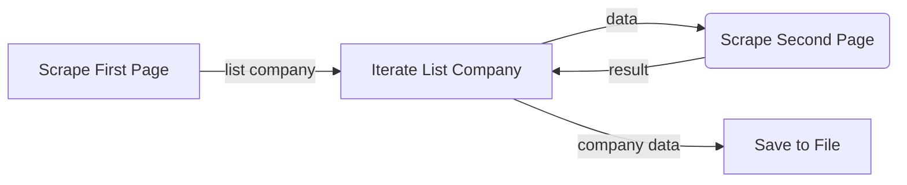

# Vietnamese Stock Market  Scraping

This program extract company data from **Vietnamese Stock Market** page and serve the data via **REST API**. The program consist of 2 components, first is **Scraping** script to extract data from Vietnamese Stock Market and second is **Web Service** to serve data via **REST API**.

## Scraping

For extracting data from web page this program use **http** request to capture the raw element data from web page. Filter html element that contains company data and create list of company. Then, iterate over list of company to extract more detailed company profile from company page using URL given from first page. To speed up the second process is send to **Celery Worker**.



## Web Service

The Web Service using **Flask** micro framework which is light and can handle http request by default. Company data from **Scraping** program is loaded into **MySQL** database. **MySQL** is quick to setup and have good performance. The database contains 2 table for storing company profile and financial summary. This program also use **ORM SQLAlchemy** to handle migration and mapping. 


# API Endpoint

## Get All Companies
Get all company profile data

**URL** : `/api/companies`

**Method** : `GET`

## Success Response

**Code** : `200 OK`

**Content**

```json
{
    "status_code": 200,
    "message": "successful",
    "data": [
			    {
		            "company_description": "Processing and exporting aquatic products; breeding aquatic products; importing materials and commodities; trading; operating restaurants; providing services; and other business scopes decided by the Board of Directors and in line with the laws",
		            "company_email": "aquatex@hcm.vnn.vn",
		            "company_name": "BEN TRE AQUAPRODUCT IMPORT AND EXPORT JSC",
		            "company_phone_number": [
		                "(84.75) 860 265",
		                "(84.75)860 346"
		            ],
		            "company_street_address": "Village 9, Tan Thach Commune, Chau Thanh District, Ben Tre Province",
		            "company_url": "http://stock.vietnammarkets.com/food-processing/ABT/",
		            "company_website": "www.aquatexbentre.com",
		            "country": "Vietnam",
		            "created_at": "Sun, 10 Jun 2018 07:29:35 GMT",
		            "id": 1,
		            "industry": "Food processing"
		        },
		        ...
		    ]
}
```
## Get Company by Name
Get company profile data by name

**URL** : `/api/companies?company_name=ASIA COMMERCIAL BANK`

**Method** : `GET`

## Success Response

**Code** : `200 OK`

**Content**

```json
{
    "status_code": 200,
    "message": "successful",
    "data": [
			    {
		            "company_description": "-Mobilizing short-term, medium-term and long-term capital in forms of demand and term deposits, Receiving investment and development capital from domestic organizations, borrowing from other credit organizations; Providing short-term, medium-term and long-term loans;- Deducting bonds and valuable papers; Raising funds to set up joint venture companies; - Providing payment services; - Trading foreign exchanges, jewelries and providing international payment services, mobilizing capital from foreign organizations - Factoring.",
		            "company_email": "acb@acb.com.vn",
		            "company_name": "ASIA COMMERCIAL BANK",
		            "company_phone_number": [
		                "(84 - 8) 929 0999",
		                "(84 - 8) 839 9885"
		            ],
		            "company_street_address": "442 Nguyen Thi Minh Khai Street, District 3, HCM City",
		            "company_url": "http://stock.vietnammarkets.com/banking/ACB/",
		            "company_website": "http://www.acb.com.vn",
		            "country": "Vietnam",
		            "created_at": "Sun, 10 Jun 2018 07:29:35 GMT",
		            "id": 2,
		            "industry": "Banking"
	            }
		    ]
}
```
## Get Company by Industry
Get company profile data by industry

**URL** : `/api/companies?company_name=electricity`

**Method** : `GET`

## Success Response

**Code** : `200 OK`

**Content**

```json
{
    "status_code": 200,
    "message": "successful",
    "data": [
			    {
		            "company_description": "Sản xuất và cung ứng điện năng cho hệ thống điện lưới quốc gia theo hợp đồng ký kết dài hạn với Tổng công ty Điện lực Việt Nam",
		            "company_email": "",
		            "company_name": "NAM MU HYDROPOWER JOINT STOCK COMPANY",
		            "company_phone_number": [
		                "(84-1) 982 7276",
		                "(84-1) 982 7276"
		            ],
		            "company_street_address": "Xã Tân Thành, huyện Bắc Quang, tỉnh Hà Giang",
		            "company_url": "http://stock.vietnammarkets.com/electricity/HJS/",
		            "company_website": "",
		            "country": "Vietnam",
		            "created_at": "Sun, 10 Jun 2018 07:29:36 GMT",
		            "id": 75,
		            "industry": "Electricity"
		        },
		        ...
		    ]
}
```
## Get Company by Revenue
Get company profile data by industry

**URL** : `/api/companies?revenue_gte=81000000000`

**Method** : `GET`

## Success Response

**Code** : `200 OK`

**Content**

```json
{
    "status_code": 200,
    "message": "successful",
    "data": [
			    {
		            "company_description": "Processing and exporting aquatic products; breeding aquatic products; importing materials and commodities; trading; operating restaurants; providing services; and other business scopes decided by the Board of Directors and in line with the laws",
		            "company_email": "aquatex@hcm.vnn.vn",
		            "company_name": "BEN TRE AQUAPRODUCT IMPORT AND EXPORT JSC",
		            "company_phone_number": [
		                "(84.75) 860 265",
		                "(84.75)860 346"
		            ],
		            "company_street_address": "Village 9, Tan Thach Commune, Chau Thanh District, Ben Tre Province",
		            "company_url": "http://stock.vietnammarkets.com/food-processing/ABT/",
		            "company_website": "www.aquatexbentre.com",
		            "country": "Vietnam",
		            "created_at": "Sun, 10 Jun 2018 07:29:35 GMT",
		            "id": 1,
		            "industry": "Food processing"
		        },
		        ...
		    ]
}
```
## Setup Application
Setup this program with virtualenv ( *assume RabbitMQ and MySQL is up and running* )
```
virtualenv -p python3 venv
```
Activate environment
```
source venv/bin/activate
```
Install dependencies
```
pip install -r requirements.txt
```
## Running Scrape Script

First run celery worker 
```
celery worker -A scrape.worker
```
Then run scrape script
```
python scraper.py
```
## Running Web Service
Setup Environment Variables for development
```
export FLASK_CONFIG=development
export FLASK_ENV=development
export FLASK_APP=run.py
```
Initialize Database
```
flask db init
flask db migrate
flask db upgrade
```
Load  **company_profile.json** file to Database
```
flask shell
> from api.db_loader import DBLoader
> dl = DBLoader()
> dl.loader("company_profile.json")
```
Run flask server
```
flask run
```

## Requirements
- Python 3.6.5
- MySQL 5.7.21
- RabbitMQ 3.7.5